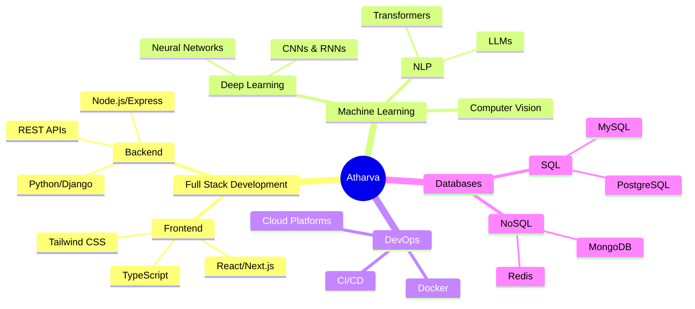

<div align="center">

<!-- Header with gradient -->


<!-- Animated typing -->
<p align="center">
  
</p>

<!-- Badges -->
<p align="center">
  
  
  
</p>

</div>

---

## 🌐 Portfolio Website

<div align="center">
  
[](https://atharva-portfolio.ddns.net/)

<a href="https://atharva-portfolio.ddns.net/" target="_blank">
  
</a>

**🔗 [atharva-portfolio.ddns.net](https://atharva-portfolio.ddns.net/)**

*Experience my work, projects, and journey in an interactive showcase*

</div>

---

## 🎯 About Me


```yaml
name: Atharva Mandavkar
location: Nagpur, India
role: Full Stack Developer & ML Engineer
education: Computer Science & Engineering
passion: Building AI-powered solutions

current_focus:
  - Machine Learning & Deep Learning
  - Web Development (MERN Stack)
  - Open Source Contributions
  - Cloud Architecture

philosophy: "Code is poetry written in logic"
fuel: Coffee + Curiosity
status: Always learning, Always building
```

### 🌟 What Drives Me

- 🚀 Creating impactful solutions that solve real problems
- 🤖 Exploring the fascinating intersection of AI and software
- 🌱 Continuous learning and adapting to new technologies
- 🤝 Collaborating on innovative open-source projects
- 💡 Turning creative ideas into functional reality

<br clear="both"/>

---

## 🛠️ Technology Arsenal

<div align="center">

### Languages & Frameworks

<table>
<tr>
<td align="center" width="96">

<br>Python
</td>
<td align="center" width="96">

<br>JavaScript
</td>
<td align="center" width="96">

<br>TypeScript
</td>
<td align="center" width="96">

<br>React
</td>
<td align="center" width="96">

<br>C++
</td>
<td align="center" width="96">

<br>Node.js
</td>
</tr>
</table>

### AI/ML & Data Science

<table>
<tr>
<td align="center" width="96">

<br>TensorFlow
</td>
<td align="center" width="96">

<br>PyTorch
</td>
<td align="center" width="96">

<br>Hugging Face
</td>
<td align="center" width="96">

<br>NumPy
</td>
<td align="center" width="96">

<br>Pandas
</td>
</tr>
</table>

### DevOps & Tools

<table>
<tr>
<td align="center" width="96">

<br>Docker
</td>
<td align="center" width="96">

<br>GitHub
</td>
<td align="center" width="96">

<br>Git
</td>
<td align="center" width="96">

<br>Ubuntu
</td>
<td align="center" width="96">

<br>MySQL
</td>
<td align="center" width="96">

<br>MongoDB
</td>
</tr>
</table>

</div>

---

## 📊 GitHub Statistics

<div align="center">
  


</div>

<div align="center">
  
  
</div>

---

## 📈 Contribution Activity

<div align="center">


<table width="100%">
<tr>
<td width="50%">

</td>
<td width="50%">

</td>
</tr>
<tr>
<td width="50%">

</td>
<td width="50%">

</td>
</tr>
</table>

</div>

---

## 🏆 GitHub Trophies

<div align="center">
  
</div>

---

## 🐍 Contribution Snake

<div align="center">
  
</div>

---

## 💼 Experience & Skills

<div align="center">



</div>

---

## 🤝 Connect With Me

<div align="center">

<a href="mailto:mandavkaratharva@gmail.com">
  
</a>
<a href="https://www.linkedin.com/in/atharva-mandavkar-b66b94179/">
  
</a>
<a href="https://github.com/Atharva0177">
  
</a>
<a href="https://atharva-portfolio.ddns.net/">
  
</a>
<a href="https://twitter.com/Atharva0177">
  
</a>

### 📧 Email: mandavkaratharva@gmail.com

</div>

---

## 💭 Random Dev Quote

<div align="center">
  
</div>

---

## 📌 Pinned Repositories

<div align="center">

[](https://github.com/Atharva0177/portfolio)
[](https://github.com/Atharva0177/machine-learning-projects)

</div>

---

<div align="center">

### 💡 *"The only way to do great work is to love what you do"*

### ⚡ Fun Fact: I debug with console.log() and I'm not ashamed! 😄


---

<p align="center">
  
  
</p>

**⭐ Star my repositories if you find them interesting!**

</div>